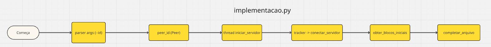
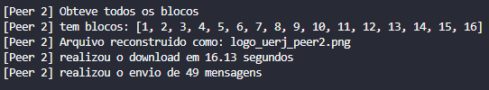
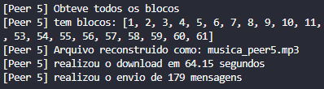

# Minibit

Implementação de um Sistema de Compartilhamento Cooperativo de Arquivos com Estratégias Distribuídas.

## Diagrama da arquitetura





## Protocolo de comunicação

A comunicação entre peers e o tracker no sistema ocorre através de sockets.

O tracker inicia e aguarda a entrada dos peers na rede. Todos os peers antes de entrar na rede iniciam o servidor para aceitar conexões do tipo cliente e cada um deles, inclusive o tracker, se conectam entre si, formando assim uma rede com diversos servidores e clientes.

Ao iniciar o servidor, algumas threads são iniciadas:

1. Uma thread para iniciar o processador das mensagens  que verifica a "caixa postal" do peer e processa cada mensagem que recebeu;

2. Uma thread que ativa o ativo de estoque de blocos de forma constante e atualizada;

3. Uma thread que ativa o recebimento e o enpacotamento de novas mensagens na caixa postal do peer até que a conexão seja encerrada.

As mensagens trocadas entre os peers seguem o padrão JSON e possuem um atributo "tipo" que define como a mensagem será tratada. Os tipos que são reconhecidos no sistema:

1. REGISTRO -> Solicitação de registro de um cliente em um servidor;

2. ESTOQUE -> Mensagem de envio de estoque de um peer para o outro;

3. PEDIDO -> Mensagem de pedido de bloco, um peer solicita um bloco para o outro;

4. NOVO_PEER -> Mensagem que mostra um novo peer que entrou na rede;

5. LISTA_PEERS -> Mensagem que mostra a um peer novo na rede todos os outros que já estão lá para ele se conectar com eles;

6. BLOCO -> Mensagem que possui o bloco que um peer está enviando para o outro.

## Estratégia para rarest first e tit-for-tat


Está implementado no código o rarest-first.
O rarest-first é um algoritmo que prioriza o download dos blocos mais raros primeiro, para assim tornar esse bloco mais disponível na rede entre os peers e então o download ser mais rápido e evitando que blocos se tornem indisponíveis, já que se somente um peer tem um determinado bloco e ele sai, teríamos indisponibilidade de blocos. No nosso código o tracker funciona como seed, então ele possui todos os blocos e é possível os outros peers baixar a partir dele, então esse problema de blocos indisponíveis não iria acontecer.

No código, a funcionalidade está localizada em peer.py e funciona da seguinte forma:

1. Cada peer recebe mensagens de estoque dos outros peers, informando quais blocos este peer que enviou a mensagem tem.

```py
        case "ESTOQUE":
            peer_id = mensagem.get("id")
            peer_estoque = mensagem.get("estoque")
            
            if not (peer_id, peer_estoque) in self.estoques:
                with self.lock:
                    self.estoques.append((peer_id, list(peer_estoque)))
            else:
                for estoque in self.estoques:
                    if estoque[0] == peer_id:
                        with self.lock:
                            estoque = (peer_id, peer_estoque)
                            break
                    
            self.log(f"Estoque do peer {peer_id} recebido")
```
2. Essa informação é guardada em self.estoques como uma lista de tuplas, em que temos a informação do id do peer e os blocos que este peer possui.

3. Quando um peer quer pedir um bloco, ele vai chamar a função receber_estoques(). 

4. Esta função vai construir uma lista com os blocos faltantes do peer que chamou, e também uma lista de blocos que estão disponíveis em outros peers.

5. A função também serve para verificar se o arquivo está completo. Se blocos_faltando for vazio, então quer dizer que tem todos os blocos, e então vai colocar como True a flag arquivo_completo.

6. blocos_faltando é uma lista com a numeração dos blocos que faltam para o peer e que estão disponíveis em outros peers. Por exemplo, ele podia vir assim: [2, 3, 5, 5, 6, 6, 3, 3] em que temos 2 ocorrências do bloco 5, isso quer dizer que tem o peer não possui o bloco 5, e que outros 2 peers tem esse bloco. nesse exemplo que dei, os mais raros seria o bloco de índice 2, que é aparece somente uma vez. Isso significa que somente um peer na rede possui este bloco. Isto é importante para a estratégia de rarest-first a seguir.

7. Vem então o rarest-first. Utilizamos o Counter para contar a frequência de cada bloco na lista blocos_faltante, com minima_frequencia verificamos os blocos de menor frequência, ou seja, os mais raros.

8. Em seguida, utilizamos um for para contar e guardar os blocos mais raros, guardamos em raros_blocos

9. Caso tenhamos mais de um bloco considerado raros, isso seria no caso em que temos a mesma frequencia, usamos random para escolher um bloco aleatório e guardamos em r_bloco_escolhido.

10. Depois, verificamos os peers que possuem esse bloco, caso tenha mais de um peer com esse bloco raro que queremos, usamos random para escolher.

11. Por fim, retornamos -> return (r_peer_id_escolhido, r_bloco_escolhido) o id do peer e o bloco que queremos baixar, este sendo o mais raro.

12. Para verificação da funcionalidade, usamos log para mostrar a frequência dos blocos em ordem decrescente, do menos raro para o mais raro, e também mostramos os blocos que são realmente considerados os mais raros, ou seja, os de menor frequência.

## Resultados de testes

**• Exemplo de Execução:**


**• Resultado com imagem (PNG):**





**• Resultado com documento (PDF):**


**• Resultado com música (MP3):**





**• Resultado com vídeo (MP4):**`


## Dificuldades Enfrentadas

- Implementação do algoritmo Tit-for-Tat com Sockets:
Houve grande desafio em adaptar a lógica do tit-for-tat à arquitetura do projeto, que dependia de comunicação entre peers via sockets. A complexidade em manter o controle de estado dos peers e realizar desbloqueios periódicos de forma sincronizada dificultou a finalização completa dessa funcionalidade. Apesar disso, conseguimos implementar uma lógica funcional que preenche o top4 de peers com base na disponibilidade dos blocos mais raros, conforme o esperado na estratégia de rarest-first.


- Adaptação da estratégia Rarest-First:
A lógica de rarest-first inicialmente foi desenvolvida de forma isolada, focada na validação de uma estrutura de dados diferente da representação exata no projeto o que dificutou sua integração. Para integrá-la ao sistema de compartilhamento real entre peers, foi necessário reestruturar a solução com base na estrutura de dados utilizada no projeto, o que só foi possível com a colaboração ativa de colegas da equipe, que ajudaram a identificar os pontos de integração corretos.
  

- Compreensão de códigos de outros integrantes:
No início do desenvolvimento, houve dificuldade para entender partes do código desenvolvidas por outros membros do grupo, devido a diferentes estilos e abordagens de implementação. No entanto, as reuniões de alinhamento e as conversas frequentes via chat permitiram esclarecer dúvidas e melhorar o entendimento coletivo da base de código, facilitando a colaboração e o progresso do projeto.
## Reflexão Individual

**• Artur:**
Durante o desenvolvimento do trabalho de Sistemas Distribuídos, pude refletir sobre minha participação e aprendizado ao longo do projeto. Embora minha contribuição tenha sido proporcionalmente menor em comparação com a de outros integrantes, as reuniões de alinhamento foram extremamente valiosas para o entendimento coletivo e evidenciaram diferentes níveis de familiaridade com as tecnologias adotadas no projeto entre os membros da equipe. Em diversos momentos, o apoio dos integrantes da equipe foi essencial para destravar pontos em que dificuldades foram encontradas, o que reforçou a importância da colaboração em projetos. Apesar de o sistema não ter sido finalizado em sua totalidade, considero extremamente enriquecedor o processo de implementação de uma solução de cenário real, ainda que parcial, pois me permitiu aprofundar o entendimento sobre conceitos teóricos e práticos do contexto abordado.

**• Brenno:** 
A tarefa de implementar um sistema que simula o BitTorrent foi muito interessante e ensinou bastante sobre o funcionamento de uma rede P2P. Também foi ótimo poder aperfeiçoar e entender melhor as comunicações por socket, que foram muito utilizadas em nosso sistema. O algoritmo foi desafiador, mas foi gratificante conseguir superar as diversas dificuldades da implementação. Para o aprendizado foi ótimo. A maior dificuldade foi conseguir alinhar cada etapa com a equipe, pois houve desafios relacionados à forma como o trabalho foi dividido entre os participantes. Cada integrante tem seu próprio estilo de codificação e organização, o que acabou tornando o entendimento do código dos colegas um pouco mais complexo. Além disso, foi necessário aguardar atualizações ou correções de partes específicas para que outras pudessem avançar, o que impactou no ritmo de desenvolvimento. Apesar disso, a experiência foi valiosa para compreender melhor a importância da comunicação e da coordenação em projetos colaborativos.

**• Paulo José:**
Trabalho foi bem difícil e trabalhoso, muito complicado, mas consegui aprender bastante não só sobre torrent mas também de Python, Git, e programação no geral. Montar a parte de divisão e construção de arquivos foi bastante interessante, transformar um vídeo de vários MB em bytes, fazer um hash para validação desse arquivo, e depois reconstruir o arquivo e verificar que o hash é idêntico e, portanto, o arquivo é idêntico ao original foi bastante interessante. A estratégia do rarest também foi bem bacana de fazer, contar os blocos e tal para assim pedir os blocos raros é, ao mesmo tempo que um tanto simples, poderoso para o sistema. Fazer os peers se comunicarem entre si, mostrando seu estoque para outros peers, solicitando blocos pros outros peers,e eles se ajudando para que todos finalizem o arquivo é bem legal.

**• Pedro Paulo:**
